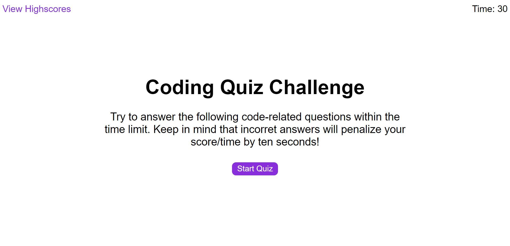
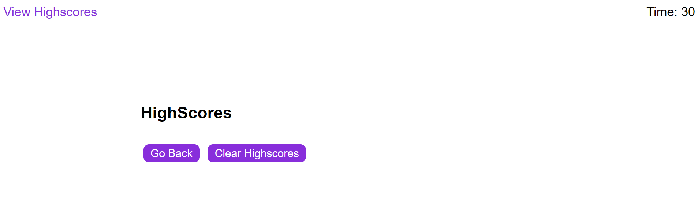

# Web-APIs-Code-Quiz

## Description

To create a simple code quiz when upon clicking start, a multiple choice timed quiz will begin. During the quiz, the user will be able to select one of the multiple choice answers, however, if the wrong answer is selected, a time penalty of 10 seconds will be deducted from the time remaining. Upon finishing quiz, the time remaining will be recorded down as the user's score.

  1. The URL of the deployed application: https://ning1604.github.io/Web-APIs-Code-Quiz/
  2. The URL of the GitHub repository: https://github.com/ning1604/Web-APIs-Code-Quiz

## Quiz Mock-Up

The following animation demonstrates the mock-up application's functionality:

## Quiz navigation information

Clicking on the "view highscores" link in the top left, will bring you to the highscore section where the scores will be displayed. Refer to image below.

On the view highscore section:
Clicking on "Go Back" button (left button) will bring user back to the welcome page of the quiz. 
Clicking on "Clear Highscores" button (right button) will clear all current highscores. Refer to image below.

## Installation

  1. Have this repository open in GitHub and click "Code" and copy the given URL.
  2. Open Git Bash and change to a directory where you want to create the local clone.
  3. Once in the chosen directory location, type in the following command (step 4) and paste in the url of the repository from step 1.
  4. git clone "exampleUrl"
  Tip: Ensure that that your URL is inclosed in the quotations.
